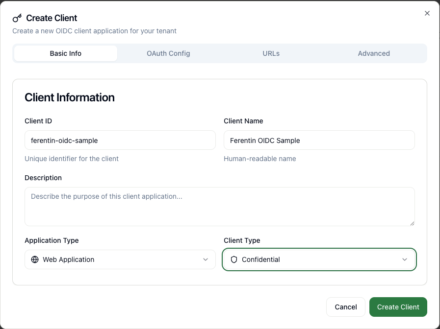
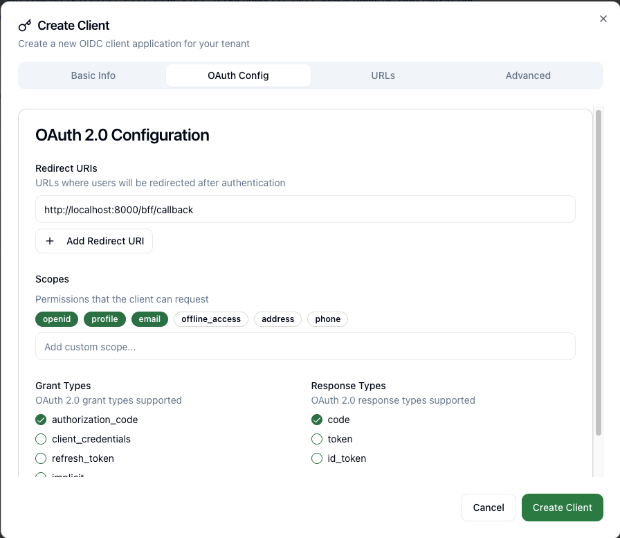
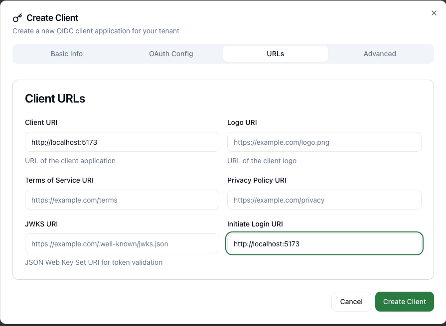

# ferentin-oidc-sample

A demonstration of **Authorization Code Flow with PKCE** using a secure **Backend-for-Frontend (BFF)** pattern.

## Overview

This mono-repo contains two applications that work together to implement secure OIDC authentication:

1. **ferentin-react-spa-sample** – A React + Vite SPA that communicates only with the BFF
2. **ferentin-python-sample** – A Python FastAPI BFF that handles OIDC flows and token management

## Architecture

```
[React SPA] <--HTTP-only cookies--> [Python FastAPI BFF] <--OAuth tokens--> [Ferentin OIDC Provider] <--OIDC tokens--> [Your IDP]
                                                                         \
                                                                          --> [Protected APIs]
```

### Key Security Features

- **Tokens never exposed to browser** – Access/refresh tokens stored server-side only
- **HTTP-only cookies** for session management
- **CSRF protection** with dedicated token
- **PKCE** for additional security
- **Secure cookie attributes** for production

## Quick Start

### Prerequisites

- Node.js 18+ and npm
- Python 3.8+
- OIDC Application configured in Ferentin

### 1. Start the Backend (BFF)

```bash
cd ferentin-python-sample
python -m venv .venv
source .venv/bin/activate  # On Windows: .venv\Scripts\activate
pip install -r requirements.txt
cp .env.example .env
# Edit .env with your OIDC provider details
./run.sh
```

The backend will start on `http://localhost:8000`

### 2. Start the Frontend (SPA)

```bash
cd ferentin-react-spa-sample
npm install
npm run dev
```

The frontend will start on `http://localhost:5173`

### 3. Test the Flow

1. Open `http://localhost:5173` in your browser
2. Click "Login" to start the OIDC flow
3. Authenticate with your OIDC provider
4. You'll be redirected back and logged in
5. Try the "Call Protected API" button to test authenticated requests

## Configuration

### OIDC Provider Setup

You'll need to configure an OIDC client in Ferentin. Follow these steps:

#### 1. Create Client Application



Create a new OIDC client application with the following settings:
- **Client ID**: `ferentin-oidc-sample` (or your preferred ID)
- **Client Name**: `Ferentin OIDC Sample`
- **Application Type**: Web Application
- **Client Type**: Confidential

#### 2. Configure OAuth Settings



Configure the OAuth 2.0 settings:
- **Redirect URIs**: `http://localhost:8000/bff/callback`
- **Scopes**: `openid`, `profile`, `email` (and any additional scopes you need)
- **Grant Types**: Authorization Code (checked)
- **Response Types**: code (checked)

#### 3. Set Client URLs



Configure the client URLs:
- **Client URI**: `http://localhost:5173` (your SPA's URL)
- **Initiate Login URI**: `http://localhost:5173` (optional, for your SPA)

#### Required Settings Summary

- **Redirect URI**: `http://localhost:8000/bff/callback`
- **Allowed Origins**: `http://localhost:5173` (for development)
- **Grant Types**: Authorization Code
- **Response Types**: code
- **PKCE**: Required/Enabled


### Environment Variables

Copy `ferentin-python-sample/.env.example` to `.env` and configure:

```bash
OIDC_ISSUER=https://auth.ferentin.net/tenant/{your-tenant-id}
OIDC_CLIENT_ID=your-client-id
OIDC_CLIENT_SECRET=your-client-secret  # Optional for public clients
FRONTEND_ORIGIN=http://localhost:5173
REDIRECT_PATH=/bff/callback
API_BASE_URL=https://your-api.com  # Optional, for proxying API calls
```

## Project Structure

```
ferentin-oidc-sample/
├── README.md
├── .gitignore
├── ferentin-react-spa-sample/     # React SPA frontend
│   ├── package.json
│   ├── tsconfig.json
│   ├── vite.config.ts
│   ├── index.html
│   └── src/
│       ├── main.tsx
│       ├── App.tsx
│       └── api.ts
└── ferentin-python-sample/        # FastAPI BFF backend
    ├── requirements.txt
    ├── .env.example
    ├── run.sh
    ├── main.py
    └── README.md
```

## API Endpoints

### BFF Endpoints

- `GET /bff/login` - Initiate OIDC login flow
- `GET /bff/callback` - Handle OIDC callback
- `GET /bff/me` - Get current user info
- `POST /bff/logout` - Logout and clear session
- `GET /bff/api/*` - Proxy to protected APIs (example)

### Frontend API Client

The React app includes an API client (`src/api.ts`) that:

- Automatically includes CSRF tokens
- Handles authentication errors
- Provides typed responses

## Development

### Frontend Development

```bash
cd ferentin-react-spa-sample
npm run dev          # Start dev server
npm run build        # Build for production
npm run preview      # Preview production build
```

### Backend Development

```bash
cd ferentin-python-sample
source .venv/bin/activate
uvicorn main:app --reload --host 0.0.0.0 --port 8000
```

## Production Deployment

For production deployment:

1. **Frontend**: Build static assets and serve via CDN/web server
2. **Backend**: Deploy to container platform, configure:
   - `FRONTEND_ORIGIN` to your SPA domain
   - Secure cookie settings (`Secure=True`, `SameSite=None`)
   - HTTPS for all endpoints
   - Session storage (Redis/database instead of in-memory)

## Security Considerations

- All tokens are stored server-side only
- HTTP-only cookies prevent XSS token theft
- CSRF tokens protect against cross-site request forgery
- PKCE adds protection against authorization code interception
- Secure cookie attributes for production HTTPS

## Contributing

This repository serves as a reference implementation. Feel free to:

- Fork and adapt for your Ferentin tenant
- Submit issues for bugs or improvements
- Contribute documentation or examples

## License

MIT License - see LICENSE file for details
